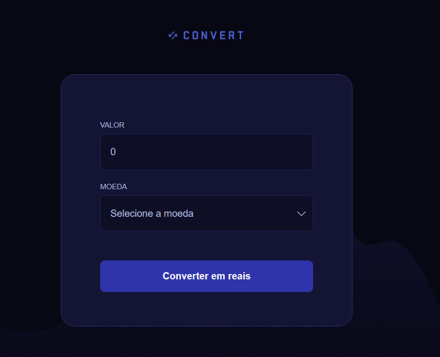
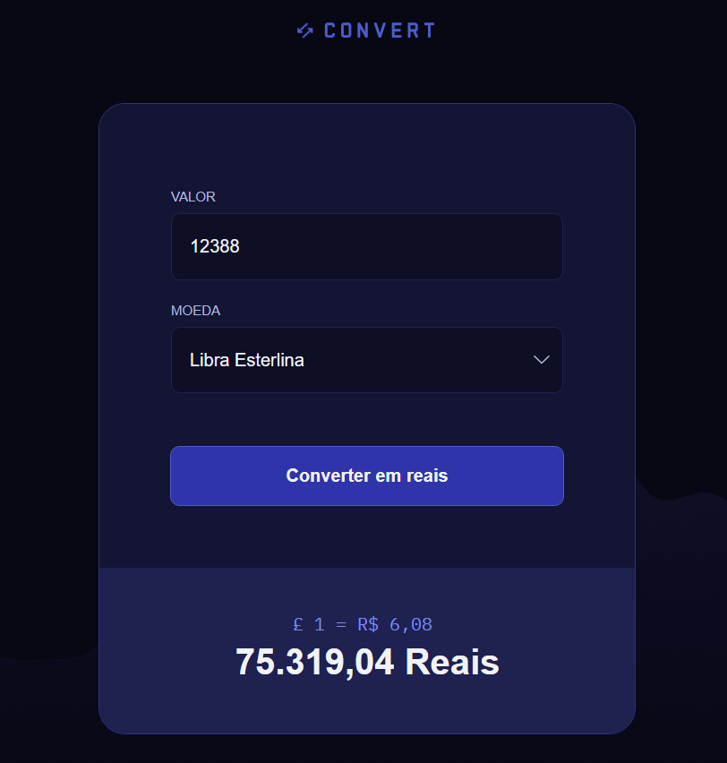

# ✅ Conversor de Moedas

Este projeto é um **conversor de moedas**, desenvolvido com **HTML, CSS e JavaScript**. A ferramenta permite que você converta valores de Dólar Americano (USD), Euro (EUR) e Libra Esterlina (GBP) para Real Brasileiro (BRL), uma solução prática para quem precisa fazer conversões básicas de câmbio sem complicação.

🔗 Acesse o projeto online  
https://guiihsantos.github.io/Convent-coin/

## Funcionalidades

1.  **Digite o valor** que deseja converter no campo "Valor".
2.  **Selecione a moeda** de origem (USD, EUR ou GBP).
3.  **Clique no botão** "Converter".
4.  O resultado será exibido na parte inferior da tela.

## 📦 Tecnologias usadas:

- 
- 
- 

## 📷 Imagens do projeto:

  
 
    
    
  

